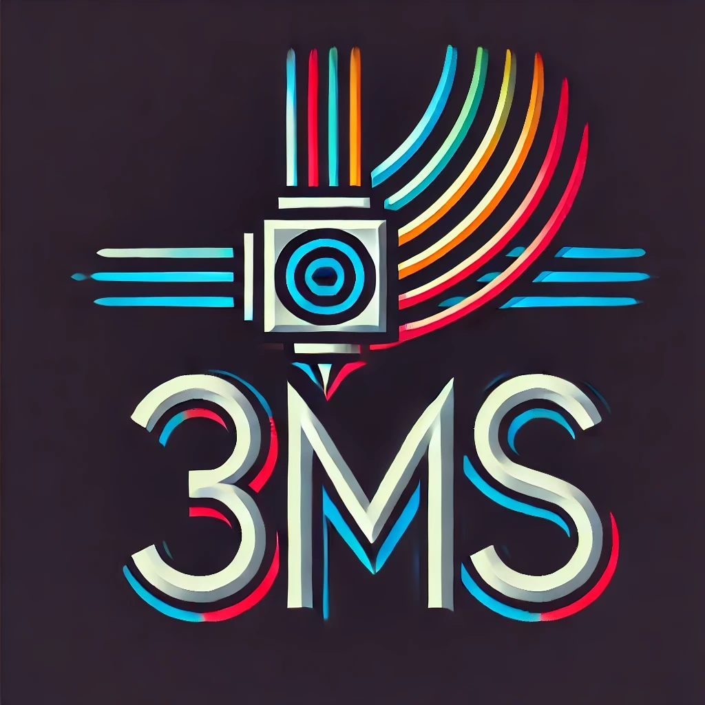

# The 3MS

The 3MS is short for MMMS, which stands for **M**odular **M**ulti **M**aterial **S**ystem

## Documentation

Documentation is available [here](https://3dcoded.github.io/3MS)

## Support

If you want to support the 3MS project, click the link below. Anything you give goes directly into the development of the 3MS and my other projects. Thank you!

## More Projects

If you like this project, don't forget to give it a star! Also, check out my other projects:

- [DynamicMacros](https://github.com/3dcoded/DynamicMacros), never restart Klipper again for simple macros
- [KlipperMaintenance](https://github.com/3DCoded/KlipperMaintenance), maintenance reminders for Klipper

## Inspiration

- Prusa MMU1
- Bambu AMS

## Sample Prints

If you like this project, don't forget to star it!

Model: [Sheep by Cipis](https://www.printables.com/model/838872-sheep-multi-material-remix)

---

Model: [Monolith Cryptic Calendar by Sevro](https://www.printables.com/model/698341-monolith-cryptic-calendar)

---

Model: Voron Cube (bundled with OrcaSlicer), painted by me

## Why 3MS?

Why use the 3MS when there are many other multi-material systems? 

Here are a few reasons:

- Extremely simple design increases reliability
- Thorough documentation to help setup, optomize, and troubleshoot
- No slicer custom toolchange G-Code needed
- Easily expandable to any number of filaments (currently up to four)
- [Toolchanges Without Tip Shaping or Filament Cutter!](https://3dcoded.github.io/3MS/guides/notip)

With that said, there are a few reasons why you might **not** want to/be able to use the 3MS:

- Klipper firmware is a requirement, so Marlin and RRF setups are a no go

## How it works

Here is a example step by step of what goes on during a single 3MS toolchange from T0 to T1:

1. Tip shaping and filament unload is performed by the slicer
2. The 3MS unloads T0 200mm at 4500mm/min (75mm/s)
3. The 3MS desyncs T0 from the extruder
4. The 3MS syncs T1 with the extruder
3. The 3MS loads T1 210mm at 4500mm/min
5. The printer loads the filament to the nozzle

The 3MS's motors work together with your printer's extruder. This way, there won't be any additional resistance from pulling the filament through a disabled extruder. Also, unloads and loads to/from the printer's extruder are fully synchronized with the 3MS. This allows for even faster toolchanges!

## What about the 3DChameleon?

I recently created a klipper plugin for the 3DChameleon after purchasing a unit. I'm sure my Chameleon could have worked if I had tuned it further, but after several months with only partial success, I gave up. I am still open to pull requests for **[3dchameleon-klipper](https://github.com/3dcoded/3dchameleon-klipper)** and will do my best to respond to issues there, but I won't be able to test it myself anymore.

## Stats

